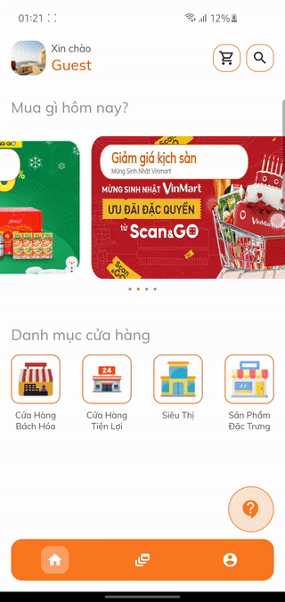

# MuaHo App

## App descriptions
- MUAHO is an e-commerce application, through MUAHO users can order products of many different brands easily. Eye-catching, intuitive interface and animation effects help increase user experience.

- MUAHO supports two main languages are English and Vietnamese and can be expanded in the future

## Technical description

- Using <strong> clean architecture </strong> to structure project.
- Strictly following the rules of clean architecture so <strong> maintenance and testing </strong> are easy.
- Using <strong> BloC pattern</strong> to state mangement.

## Important ingredients 
- [Clean architecture](https://blog.cleancoder.com/uncle-bob/2012/08/13/the-clean-architecture.html)
- [State Management BloC](https://bloclibrary.dev/#/)
- [Dependency management GetIt](https://pub.dev/packages/get_it)
- [Multi language](https://pub.dev/packages/easy_localization)
- [Firebase](https://firebase.flutter.dev/)
- [Google Map](https://pub.dev/packages/google_maps_flutter)

## Plugin 
- [Json to dart](https://github.com/simplesoft-duongdt3/json2dart_intellij_plugin/releases)
- [Bloc](https://plugins.jetbrains.com/plugin/12129-bloc)
- [Dart equatable](https://pub.dev/packages/equatable)
- [Named argument constructor generator](https://plugins.jetbrains.com/plugin/12429-dart-data-class)

## Screenshots

### Home
- Start app with splash screen
- Navigate by deep link when click on ad-banner

   

### Search - Cart 

- Search by keyword
- Adjust the product in the shopping cart
- Notification when adding products from another shop

    

### Order

- Review cart and price
- Log in or register for an account before placing an order
- Create a shipping address by Google Map
- Create order and see order detail

    

### Setting

- Log out
- Login
- Change display name
- Turn on/off dark mode
- Change language (En/Vi) 

    

### Mantenance

- Show maintenance screen when server through code 999
- Check current server status
- Go to homepage when finish maintenance
 

